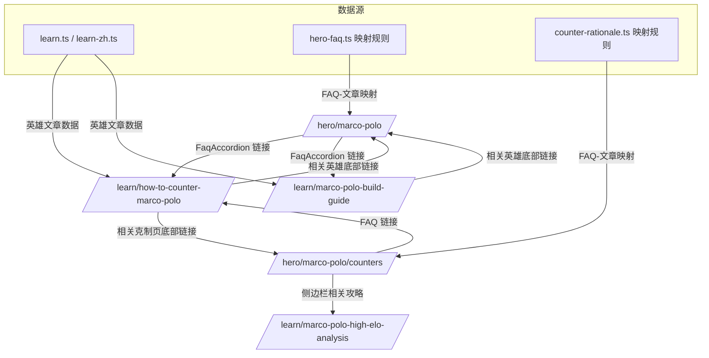

## 需求概述

在 HOKMeta 构建从 Hero → Counter → FAQ → Learn Article → Hero 的闭环内链网络，以英雄为实体中心做 Topic Cluster SEO。

## 核心需求

1. **URL 扁平化**：所有攻略文章以 `/learn/[slug]/` 存放，slug = slugify(title)，不做目录层级嵌套
2. **英雄专属攻略文章**：每个英雄生成 3 类攻略内容——英雄玩法攻略、英雄克制攻略、英雄反克制攻略
3. **FAQ 互联**：Hero 页和 Counter 页的 FAQ 答案底部链接到对应的攻略文章
4. **攻略文章反向链接**：每篇攻略文章底部链接回英雄主页和克制页
5. **Counter 页侧边栏增加攻略入口**：在已有「相关克制页」下方，增加「相关攻略」区块
6. **Sitemap 更新**：新增的英雄攻略文章 URL 写入 sitemap
7. **AI 内容风格**：像荣耀王者玩家教朋友上分，非百科风格，含实战场景和常见错误

## 优先级

- S 级：URL 保持简单，不做目录层级
- A 级：打通 FAQ → Learn Article 内链网络（这是核心）
- B 级：内容风格统一

## 技术栈

- 沿用现有栈：Next.js 14 App Router、TypeScript、Tailwind CSS
- 静态导出（output: 'export'），所有内容 build 时确定
- 多语言：en（根路径）+ zh-TW（/zh-TW/前缀）

## 实现方案

### 总体策略

基于用户的 Flat URL + Entity-Centric 方向，核心变更落在**数据层**和**视图层**，不改变路由层。

```
变更范围：
路由层 (/learn/[slug])     — 无变更，已支持通用 slug
数据层 (learn.ts/hero-faq.ts) — 新增英雄攻略文章 + FAQ-文章映射
视图层 (FaqAccordion/View)    — 增加「了解更多」链接、相关攻略区块
Sitemap                     — 补充新 URL
```

### 关键设计决策

**1. 攻略文章 URL 标题驱动**

- 标题本身就是搜索词（如 "How to Counter Marco Polo"）
- slug = 标题 slugify 后的结果
- 文章标题和 slug 在数据定义时确定，非运行时生成

**2. FAQ → 攻略文章映射规则**

- 通过 FAQ id + hero slug 可以确定对应的攻略文章 slug
- 例如：FAQ `faq-counter` + hero `marco-polo` → slug `how-to-counter-marco-polo`
- 映射逻辑封装成一个 helper 函数，传入 FAQ id 和 hero slug 返回攻略文章 URL

**3. Schema 扩展**

- `LearnArticle` 接口新增 `relatedHero?: string`（关联的英雄 slug）
- 新增关联关系：每篇英雄攻略文章知道自己关联哪个英雄
- 用于攻略文章页底部反向链接

### 文件变更清单

**修改文件：**

- `src/lib/learn.ts` — [MODIFY] `LearnArticle` 接口新增 `relatedHero` 字段；新增英雄攻略文章条目
- `src/lib/learn-zh.ts` — [MODIFY] 新增中文英雄攻略文章条目
- `src/lib/hero-faq.ts` — [MODIFY] 新增 `getRelatedArticleForFaq(faqId, heroSlug, locale)` 函数，返回关联的攻略文章 URL
- `src/lib/counter-rationale.ts` — [MODIFY] 新增 `getCounterRelatedArticle(type, heroSlug, locale)` 函数，返回攻略页 FAQ 对应的文章 URL
- `src/components/FaqAccordion.tsx` — [MODIFY] 组件 props 扩展，支持在答案底部显示「了解更多」链接
- `src/views/HeroPageView.tsx` — [MODIFY] 给 FaqAccordion 传入关联文章 URL
- `src/views/CounterPageView.tsx` — [MODIFY] FAQ 区块增加文章链接；侧边栏增加「相关攻略」区块
- `src/views/LearnArticleView.tsx` — [MODIFY] 文章底部增加英雄反向链接（如果 `article.relatedHero` 存在）
- `src/app/sitemap.ts` — [MODIFY] `getLearnSlugs()` 更新后 sitemap 自动包含新 URL

### 架构图



### 实施说明

**关于静态导出限制**：所有攻略文章 slug 必须在 `generateStaticParams` 时确定。`getLearnSlugs()` 当前只返回通用文章 slug，需扩展返回英雄攻略 slug。

**性能考量**：348 篇文章（116 英雄 x 3）的 content 全部在 `learn.ts` 中内联会导致该文件膨胀至 ~2MB。建议：

- 通用文章仍放在 `learn.ts`
- 英雄攻略文章另建独立数据文件 `src/lib/learn-hero-articles.ts`（或 JSON）
- `getLearnSlugs()` 合并两种来源的 slug

**FAQ 映射性能**：映射函数输入 FAQ id + hero slug，输出文章 slug。纯字符串查找，O(1) 复杂度，无性能问题。

**维护性**：新增英雄攻略只需编辑 `learn-hero-articles.ts` 数据文件 + 对应的 `learn-zh-hero-articles.ts`，不破坏现有文章系统。