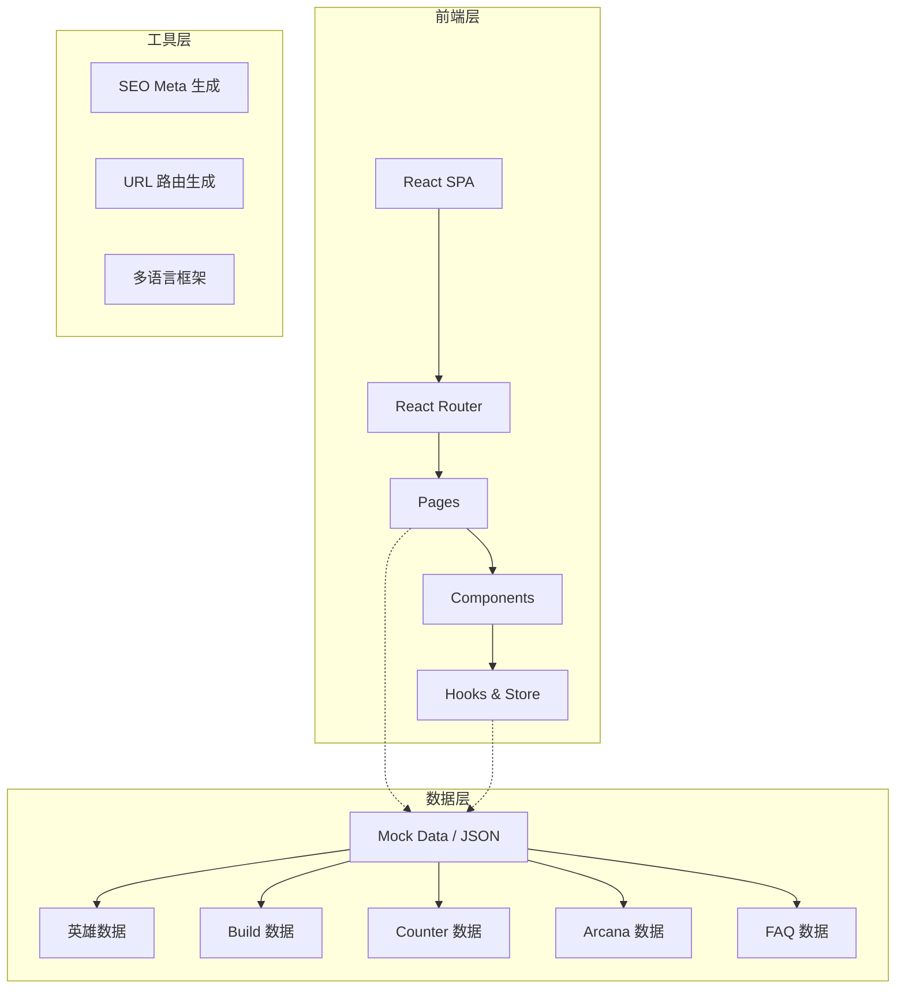
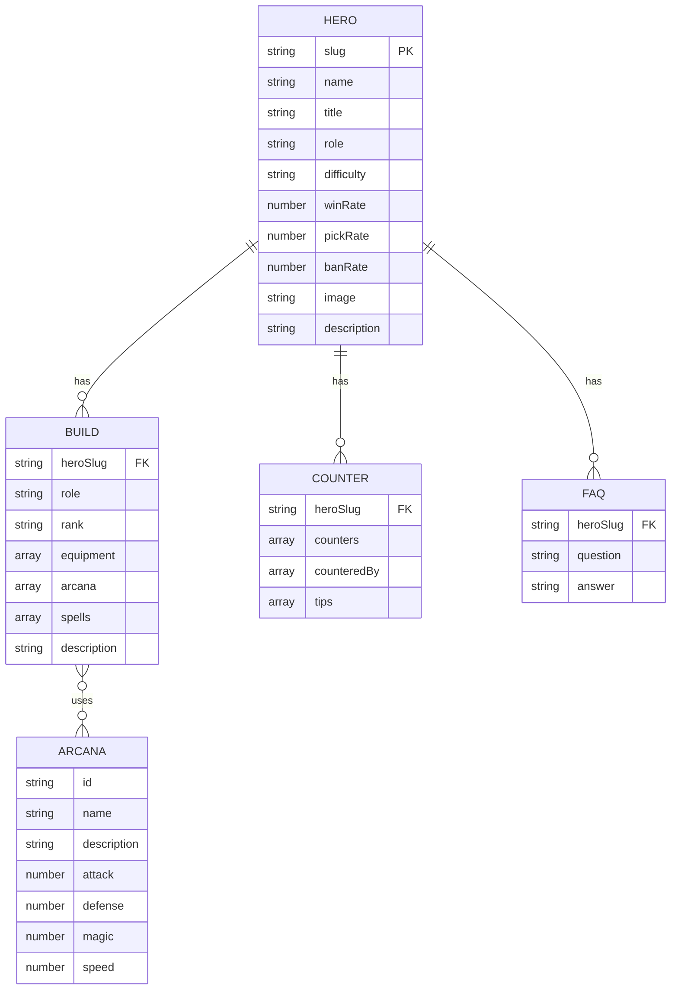

# HOK Meta - 技术架构文档

## 1. 架构设计



## 2. 技术说明

- **前端**: React 18 + TypeScript + Vite
- **路由**: React Router v6
- **样式**: Tailwind CSS 3
- **状态管理**: Zustand
- **图标**: Lucide React
- **构建工具**: Vite
- **数据**: 本地 Mock JSON 数据（为后续 API 接入预留接口）
- **SEO**: React Helmet 或动态 meta 标签

## 3. 路由定义

| 路由 | 页面 | 说明 |
|------|------|------|
| `/` | 首页 | 品牌展示、热门英雄、快速导航 |
| `/tier-list` | Tier List | 英雄强度排行 |
| `/heroes` | 英雄列表 | 所有英雄浏览与搜索 |
| `/hero/:slug` | 英雄详情 | 单个英雄概览、Build、Counter、FAQ |
| `/build/:slug` | Build 页 | 英雄最佳出装（SEO 独立页） |
| `/counters/:slug` | Counter 页 | 英雄克制关系（SEO 独立页） |
| `/build-generator` | Build Generator 工具 | 交互式出装生成器 |
| `/counter-picker` | Counter Picker 工具 | 交互式克制选择器 |
| `/best-arcana` | Arcana Tool | 最佳 Arcana 配置工具 |
| `/compare/:hero1-vs-:hero2` | Hero Compare | 两个英雄对比 |
| `/guides/:slug` | Guide/FAQ 页 | 英雄攻略与 FAQ |

## 4. 数据模型

### 4.1 数据模型定义



### 4.2 首批英雄列表（50个热门）

```text
Lam, Luna, Augran, Yaria, Dolia, Arli, Zhao Yun, Diaochan, Luban No.7, Hou Yi,
Arthur, Angela, Kaizer, Omen, Florentino, Thorne, Qi Ya, Yi Xing, Muramasa, Bai Qi,
Sun Ce, Da Qiao, Zhuang Zhou, Sun Shangxiang, Li Bai, Han Xin, Zhuge Liang, Diao Chan,
Guan Yu, Zhang Fei, Huang Zhong, Marco Polo, Gongsun Li, Pei Qinhu, Miyamoto, Nata,
Su Lie, Baili Xuance, Baili Shouyue, Dun Shan, Ming Shiyin, Gui Guzi, Yao, Yun Ying,
Meng Ya, Shen Mengxi, Mi Yue, Wang Zhaojun, Xi Shi, Mozi
```

## 5. 项目结构

```
hokmeta/
├── .trae/documents/
│   ├── prd.md
│   └── architecture.md
├── public/
│   └── data/              # Mock JSON 数据
│       ├── heroes.json
│       ├── builds.json
│       ├── counters.json
│       ├── arcana.json
│       └── faqs.json
├── src/
│   ├── components/        # 可复用组件
│   │   ├── Header/
│   │   ├── Footer/
│   │   ├── HeroCard/
│   │   ├── HeroAvatar/
│   │   ├── TierList/
│   │   ├── BuildDisplay/
│   │   ├── CounterDisplay/
│   │   ├── ArcanaDisplay/
│   │   ├── FAQAccordion/
│   │   └── SearchBar/
│   ├── pages/             # 页面组件
│   │   ├── Home/
│   │   ├── TierList/
│   │   ├── Heroes/
│   │   ├── HeroDetail/
│   │   ├── BuildPage/
│   │   ├── CounterPage/
│   │   ├── BuildGenerator/
│   │   ├── CounterPicker/
│   │   ├── ArcanaTool/
│   │   ├── HeroCompare/
│   │   └── GuidePage/
│   ├── hooks/             # 自定义 Hooks
│   │   ├── useHeroes.ts
│   │   ├── useBuilds.ts
│   │   ├── useCounters.ts
│   │   └── useArcana.ts
│   ├── store/             # Zustand 状态
│   │   └── heroStore.ts
│   ├── utils/             # 工具函数
│   │   ├── slugify.ts
│   │   └── seo.ts
│   ├── types/             # TypeScript 类型
│   │   └── index.ts
│   ├── App.tsx
│   └── main.tsx
├── index.html
├── package.json
├── tsconfig.json
├── vite.config.ts
├── tailwind.config.js
└── postcss.config.js
```
