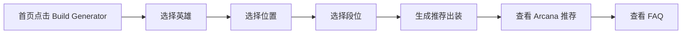
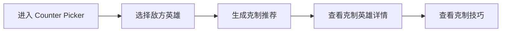

# HOK Meta - 产品需求文档 (PRD)

## 1. 产品概述

HOK Meta 是一个面向海外 Honor of Kings 玩家的英雄 Build、Counter 与 Tier List 工具平台。定位为 "The #1 HOK Build, Counter & Tier List Platform"，通过工具化页面规模化生成 SEO 高意图流量。

目标市场：英语区 → 葡萄牙语（巴西）→ 印尼语，面向全球 HOK 移动端 MOBA 玩家。

## 2. 核心功能

### 2.1 用户角色
| 角色 | 注册方式 | 核心权限 |
|------|----------|----------|
| 访客 | 无需注册 | 浏览所有工具页、英雄页、数据页 |

### 2.2 功能模块
1. **首页**: 品牌展示、快速导航到 Tier List/Build Generator/Counter Picker
2. **Tier List**: 英雄强度排行，支持按位置/赛季筛选
3. **英雄列表**: 可搜索/筛选的英雄浏览页
4. **英雄详情页**: 英雄概览、最佳 Build、Arcana、Spell、Counter、FAQ
5. **Build Generator**: 选择英雄/段位/位置，推荐最佳出装
6. **Counter Picker**: 输入敌方英雄，推荐克制英雄
7. **Arcana Tool**: 最佳 Arcana 配置推荐
8. **Hero Compare**: 两个英雄对比分析
9. **Guide/FAQ**: 英雄攻略与常见问题

### 2.3 页面详情
| 页面名称 | 模块名称 | 功能描述 |
|----------|----------|----------|
| 首页 | Hero Section | 品牌标语、核心价值展示、CTA 按钮跳转到 Tier List / Build Generator / Counter Picker |
| 首页 | 热门英雄 | 展示 Top 10 热门英雄卡片，链接到详情页 |
| 首页 | 快速搜索 | 英雄搜索框，支持自动补全 |
| Tier List | 筛选器 | 按位置（全部/战士/法师/射手/辅助/打野）、按段位筛选 |
| Tier List | 排行表格 | S/A/B/C/D 分级展示英雄头像与名称 |
| Tier List | SEO 文案 | Tier List 相关的 SEO 优化文案 |
| 英雄列表 | 搜索框 | 输入英雄名称搜索 |
| 英雄列表 | 筛选网格 | 按位置筛选，展示英雄卡片网格 |
| 英雄详情 | 英雄概览 | 英雄头像、名称、定位、难度、胜率等 |
| 英雄详情 | Build 推荐 | 最佳出装（装备图标序列） |
| 英雄详情 | Arcana 推荐 | 推荐 Arcana 配置 |
| 英雄详情 | Counter 信息 | 克制关系、被克制关系 |
| 英雄详情 | FAQ | 5-10 个常见问题手风琴 |
| Build Generator | 选择表单 | 英雄选择、位置选择、段位选择 |
| Build Generator | 结果展示 | 推荐出装、Arcana、技能 |
| Counter Picker | 输入区 | 敌方英雄选择 |
| Counter Picker | 结果展示 | 推荐克制英雄列表、胜率预测 |
| Arcana Tool | 配置选择 | 英雄/角色选择 |
| Arcana Tool | 结果展示 | 推荐 Arcana 页面、详细属性说明 |
| Hero Compare | 选择区 | 英雄 A、英雄 B 选择 |
| Hero Compare | 对比面板 | 属性对比、优劣势分析、克制关系 |

## 3. 核心流程

### 用户使用 Build Generator 流程

### 用户使用 Counter Picker 流程

## 4. 用户界面设计

### 4.1 设计风格
- **色调**: 深色主题为主，金色/琥珀色作为强调色（呼应王者荣耀的金色主题），搭配青蓝色作为辅助强调
- **背景**: 深色渐变背景 + 细微纹理，营造电竞氛围
- **字体**: 标题使用有力量感的字体，正文使用清晰易读的无衬线字体
- **布局**: 卡片式布局，圆角设计，微妙的阴影和光效
- **图标风格**: 扁平化图标，带发光效果，符合游戏氛围
- **动效**: 入场动画（交错淡入）、悬停效果（缩放+光效）、加载状态（脉冲动画）

### 4.2 页面设计概述
| 页面名称 | 模块名称 | UI 元素 |
|----------|----------|---------|
| 首页 | Hero Section | 深色渐变背景，金色主标题，动态粒子效果，三个 CTA 按钮 |
| 首页 | 热门英雄 | 英雄卡片网格，悬停发光效果 |
| Tier List | 排行表格 | S/A/B/C/D 色标标签，英雄头像网格，筛选器 |
| 英雄详情 | 信息面板 | 英雄大图头像，属性面板，出装图标序列，FAQ 手风琴 |
| Build Generator | 结果面板 | 装备图标横向排列，Arcana 色块网格，解释性文字 |

### 4.3 响应式
- 桌面优先设计
- 平板自适应（两列布局）
- 移动端单列布局，触摸优化
- 导航栏在移动端折叠为汉堡菜单
